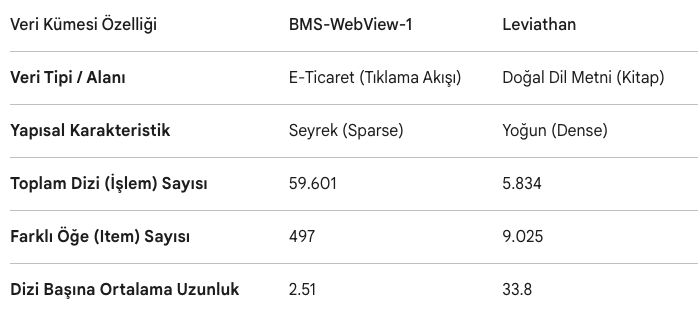
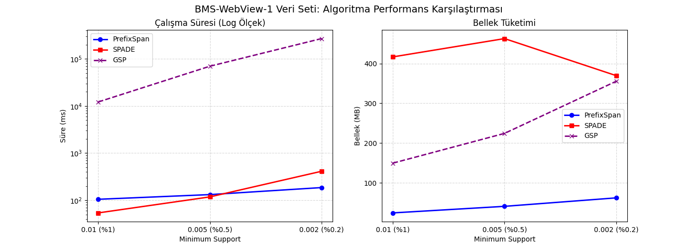
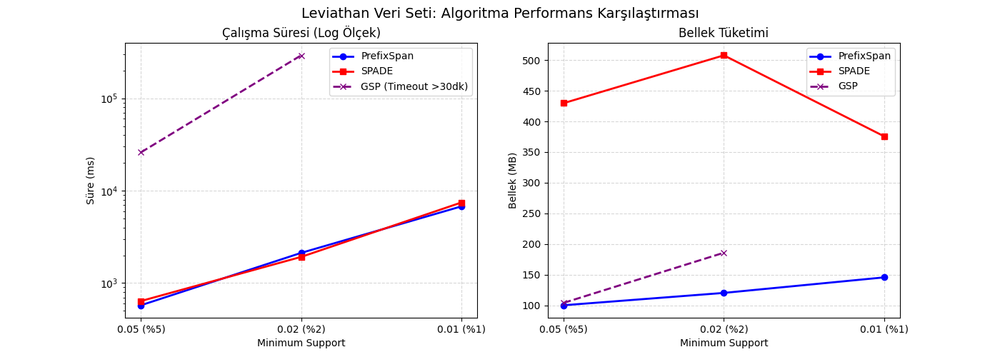
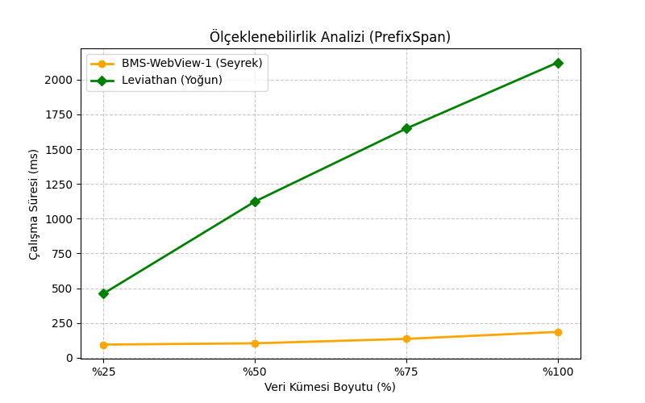

# Veri Madenciliği Projesi: Sıralı Örüntü Madenciliği Algoritmalarının Karşılaştırılması

Bu proje kapsamında iki farklı veri seti üzerinde **sıralı örüntü madenciliği** algoritmaları karşılaştırılmıştır. Amaç; farklı veri karakteristiklerinde algoritmaların **çalışma süresi**, **bellek kullanımı** ve **ölçeklenebilirlik** açısından nasıl davrandığını incelemektir.

Karşılaştırılan algoritmalar:

- **PrefixSpan**
- **SPADE**
- **GSP**

Kullanılan veri setleri:

- **BMS-WebView-1**: E-ticaret / tıklama akışı verisi, seyrek yapılı veri seti
- **Leviathan**: Doğal dil metni / kitap verisi, yoğun yapılı veri seti

---

## Projenin Amacı

Bu çalışmada veri madenciliği alanında kullanılan sıralı örüntü madenciliği algoritmalarının performansları analiz edilmiştir. Aynı veri setleri üzerinde farklı minimum support değerleri denenmiş ve algoritmaların ürettiği sonuçlar performans bakımından karşılaştırılmıştır.

Çalışmada özellikle şu sorulara cevap aranmıştır:

- Seyrek ve yoğun veri setlerinde algoritma performansı nasıl değişir?
- Minimum support değeri düştükçe çalışma süresi ve bellek kullanımı nasıl etkilenir?
- PrefixSpan, SPADE ve GSP algoritmaları arasında hangi algoritma daha verimlidir?
- Veri kümesi boyutu arttıkça algoritmaların ölçeklenebilirliği nasıl değişir?

---

## Veri Seti Özellikleri

Aşağıdaki tabloda projede kullanılan veri setlerinin temel özellikleri gösterilmiştir.



| Özellik | BMS-WebView-1 | Leviathan |
|---|---:|---:|
| Veri tipi / alanı | E-ticaret tıklama akışı | Doğal dil metni / kitap |
| Yapısal karakteristik | Seyrek | Yoğun |
| Toplam dizi / işlem sayısı | 59.601 | 5.834 |
| Farklı öğe sayısı | 497 | 9.025 |
| Dizi başına ortalama uzunluk | 2.51 | 33.8 |

---

## Uygulanan İşlem Adımları

1. **Veri setleri hazırlandı.**  
   BMS-WebView-1 ve Leviathan veri setleri SPMF formatına uygun şekilde kullanıldı.

2. **Minimum support değerleri belirlendi.**  
   Her veri seti için farklı minimum support oranları denenerek algoritmaların performans değişimi incelendi.

3. **Algoritmalar çalıştırıldı.**  
   PrefixSpan, SPADE ve GSP algoritmaları aynı veri setleri üzerinde çalıştırıldı.

4. **Çıktı dosyaları kaydedildi.**  
   Her algoritmanın ürettiği örüntüler ayrı `.txt` dosyaları halinde saklandı.

5. **Performans değerleri analiz edildi.**  
   Çalışma süresi ve bellek kullanımı karşılaştırıldı.

6. **Grafikler oluşturuldu.**  
   Sonuçlar `grafikler.py` dosyası ile görselleştirildi.

---

## Sonuç Grafikleri

### 1. BMS-WebView-1 Algoritma Performans Karşılaştırması

BMS-WebView-1 veri seti seyrek yapılı olduğu için algoritmalar daha kısa diziler üzerinde çalışmıştır. Grafiklerde minimum support değeri düştükçe GSP algoritmasının çalışma süresinin ciddi şekilde arttığı görülmektedir. PrefixSpan ise düşük bellek kullanımı ve dengeli çalışma süresiyle öne çıkmaktadır.



### 2. Leviathan Algoritma Performans Karşılaştırması

Leviathan veri seti daha yoğun ve uzun dizilerden oluştuğu için algoritmaların çalışma süresi daha belirgin şekilde artmıştır. GSP algoritması düşük support değerinde yüksek maliyet üretmiş ve %1 support seviyesinde 30 dakikayı aşarak tamamlanamamıştır. PrefixSpan ve SPADE çalışma süresi açısından yakın sonuçlar vermiştir; ancak PrefixSpan bellek kullanımı açısından daha avantajlıdır.



### 3. Ölçeklenebilirlik Analizi

Ölçeklenebilirlik analizinde PrefixSpan algoritması farklı veri kümesi boyutları üzerinde değerlendirilmiştir. BMS-WebView-1 veri setinde çalışma süresi düşük ve stabil kalırken, Leviathan veri setinde veri boyutu arttıkça çalışma süresi daha belirgin şekilde yükselmiştir.



---

## Genel Değerlendirme

Bu çalışma sonucunda **PrefixSpan algoritmasının genel olarak daha dengeli ve verimli sonuçlar verdiği** görülmüştür. Özellikle bellek tüketimi açısından PrefixSpan, hem BMS-WebView-1 hem de Leviathan veri setinde daha avantajlıdır.

**SPADE**, bazı support seviyelerinde çalışma süresi açısından PrefixSpan’a yakın sonuçlar üretmiştir; fakat bellek tüketimi daha yüksektir.

**GSP** ise özellikle minimum support değeri düştükçe ve veri yoğunluğu arttıkça performans açısından geride kalmıştır. Leviathan veri setinde düşük support seviyesinde çalışma süresinin çok fazla artması, GSP algoritmasının büyük ve yoğun veri setleri için daha maliyetli olduğunu göstermektedir.

---

## Proje Klasör Yapısı

```text
.
├── README.md
├── grafikler.py
├── requirements.txt
├── images/
│   ├── veriKumeOzellik.png
│   ├── Figure_1.png
│   ├── Figure_2.png
│   └── Figure_3.png
└── data/
    ├── BMS1_spmf.txt
    ├── Leviathan.txt
    ├── BMSWebView1/
    │   ├── bms_25.txt
    │   ├── bms_50.txt
    │   ├── bms_75.txt
    │   ├── bms_scale_25.txt
    │   ├── bms_scale_50.txt
    │   ├── bms_scale_75.txt
    │   ├── PrefixSpan/
    │   ├── Spade/
    │   └── Gsp/
    └── Leviathan/
        ├── lev_25.txt
        ├── lev_50.txt
        ├── lev_75.txt
        ├── scale_25.txt
        ├── scale_50.txt
        ├── scale_75.txt
        ├── PrefixSpan/
        ├── Spade/
        └── Gsp/
```

---

## Kurulum ve Çalıştırma

Projeyi bilgisayarınıza indirdikten sonra aşağıdaki adımları izleyebilirsiniz.

### 1. Sanal ortam oluşturma

```bash
python3 -m venv .venv
source .venv/bin/activate
```

Windows kullanıyorsanız:

```bash
python -m venv .venv
.venv\Scripts\activate
```

### 2. Gerekli kütüphaneyi yükleme

```bash
pip install -r requirements.txt
```

### 3. Grafikleri yeniden üretme

```bash
python grafikler.py
```

Bu komut çalıştırıldığında grafikler `images/` klasörüne tekrar kaydedilir.

---

## Kullanılan Teknolojiler

- Python
- Matplotlib
- SPMF formatı
- Sıralı örüntü madenciliği algoritmaları

---

## Kısa Sonuç

Bu projede yapılan deneyler, veri setinin yapısının algoritma performansını doğrudan etkilediğini göstermektedir. Seyrek veri setlerinde algoritmalar daha hızlı çalışırken, yoğun ve uzun dizilere sahip veri setlerinde çalışma süresi ve bellek ihtiyacı artmaktadır. Genel performans açısından PrefixSpan algoritması en dengeli sonuçları vermiştir.
